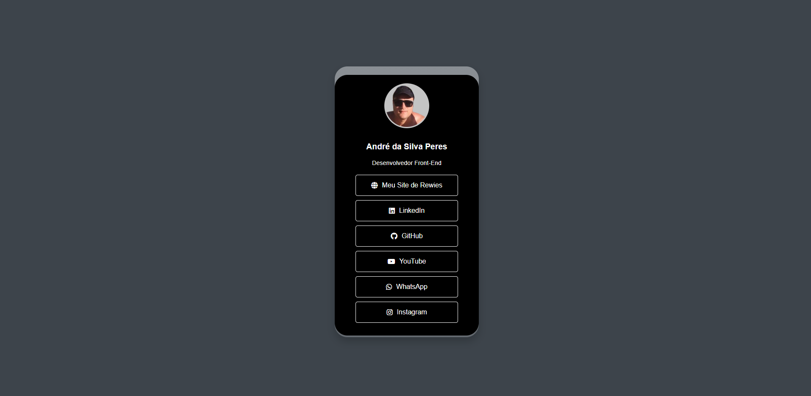

# 📱 Perfil de André da Silva Peres

Este projeto exibe um perfil interativo de André da Silva Peres, Desenvolvedor Front-End, com links para suas redes sociais e site de reviews.

## 📄 Descrição

A página exibe um perfil interativo com uma foto de André da Silva Peres, uma breve descrição, e links para suas redes sociais e portfólio. A interface é projetada para ser visualmente atraente e fácil de navegar.

## 🚀 Tecnologias Utilizadas

- HTML5
- CSS3

## 📂 Estrutura do Projeto

- `index.html` - Arquivo principal do projeto.
- `styles.css` - Arquivo de estilos do projeto.
- `img/` - Pasta contendo as imagens do perfil.

## 🖼️ Screenshot

📧 Contato
Se você tiver alguma dúvida ou sugestão, sinta-se à vontade para entrar em contato comigo através do LinkedIn ou visitar meu portfólio.

Site de Reviews: Análise Tech
LinkedIn: André da Silva Peres
GitHub: andresperes33
YouTube: Canal do André
WhatsApp: +55 38 99982-1883
Instagram: @andresperes33
